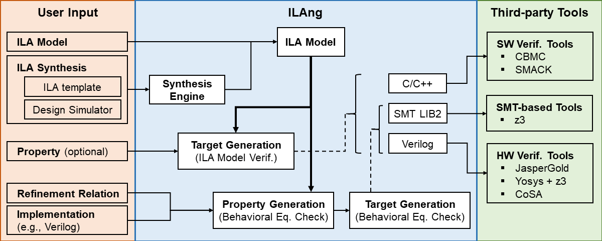

# Introduction

## Why ILA/ng

ILAng is a modeling and verification platform for systems-on-chips \(SoCs\) where **Instruction-Level Abstraction \(ILA\)** is used as the formal model for hardware components. The ILA formal model targeting the hardware-software interface enables a clean separation of concerns between software and hardware through a unified model for heterogeneous processors and accelerators. ILAng provides a programming interface for

1. constructing ILA models,
2. synthesizing ILA models from templates using program synthesis techniques,
3. verifying properties on ILA models, and
4. behavioral equivalence checking between different ILA models, and between an ILA specification and an implementation.

ILAng also provides for translating models and properties into various languages \(e.g., Verilog and SMT LIB2\) for different verification settings and use of third-party verification tools.

## Applications

The ILAng platform has been used in several applications:

* **Behavioral Equivalence Checking.** The modularity and hierarchy in the ILA models simplify behavioral equivalence checking through decomposition. \[[TODAES18](https://bo-yuan-huang.github.io/ILAng-Doc/todaes18.pdf)\] 
* **Firmware/Hardware Co-Verification**. The ILA models program-visible hardware behavior while abstracting out lower-level implementation details. This enables scalable firmware/hardware co-verification. \[[DAC18](https://bo-yuan-huang.github.io/ILAng-Doc/dac18.pdf), [DATE16](https://bo-yuan-huang.github.io/ILAng-Doc/date16.pdf)\]
* **Memory Consistency and Concurrency Reasoning**. The ILA model is an operational model that captures program-visible state updates. When integrated with axiomatic memory consistency models that specify orderings between memory operations, the transition relation can be used to reason about concurrent interactions between heterogeneous components. \[[FMCAD18](https://bo-yuan-huang.github.io/ILAng-Doc/fmcad18.pdf)\]
* **Data Race Checking of GPU Programs**. Besides general-purpose processors and accelerators, an ILA model can be synthesized for the Nvidia GPU PTX instruction set using the synthesis engine. This can then been used for data race checking for GPU programs. \[[ICCAD18](https://bo-yuan-huang.github.io/ILAng-Doc/iccad18.pdf)\]
* **Synthesizing Environment Invariants for Modular Hardware Verification**. With ILAs, we automate synthesis of environment invariants for modular hardware verification in processors and application-specific accelerators, where functional equivalence is proved between a high-level specification and a low-level implementation. \[[VMCAI20](https://bo-yuan-huang.github.io/ILAng-Doc/vmcai20.pdf)\]

## Other sources

* [POSH Upscale](https://upscale.stanford.edu/): The goal of Upscale project is to develop tools and techniques for verifying and evaluating open-source hardware, with the ILA-based methodology at its core.
* [ILAng](https://github.com/Bo-Yuan-Huang/ILAng): The public GitHub repo for ILAng platform implementation. 
* [ILAng Doxygen](https://bo-yuan-huang.github.io/ILAng-Doc/doxygen-output-html/namespaceilang.html): A web-versioned documentation of the ILAng code annotation. 
* [IMDb](https://github.com/PrincetonUniversity/IMDb): An ILA model data base containing examples, archived ILA models, ILA applications, etc.
* [ItSy](https://github.com/PrincetonUniversity/ItSy): A template-driven ILA synthesis engine using program synthesis techniques.

### Related publications

Below are the ILA-related publications \(bib-entries available below\)

* Synthesizing Environment Invariants for Modular Hardware Verification. \[[VMCAI20](https://bo-yuan-huang.github.io/ILAng-Doc/vmcai20.pdf)\]
* ILAng: A Modeling and Verification Platform for SoCs using Instruction-Level Abstractions. \[[TACAS19](https://bo-yuan-huang.github.io/ILAng-Doc/tacas19.pdf)\]
* A Formal Instruction-Level GPU Model for Scalable Verification. \[[ICCAD18](https://bo-yuan-huang.github.io/ILAng-Doc/iccad18.pdf)\]
* Integrating Memory Consistency Models with Instruction-Level Abstractions for Heterogeneous System-on-Chip Verification. \[[FMCAD18](https://bo-yuan-huang.github.io/ILAng-Doc/fmcad18.pdf)\]
* Formal Security Verification of Concurrent Firmware in SoCs using Instruction-Level Abstraction for Hardware. \[[DAC18](https://bo-yuan-huang.github.io/ILAng-Doc/dac18.pdf)\]
* Instruction-Level Abstraction \(ILA\): A Uniform Specification for System-on-Chip \(SoC\) Verification. \[[TODAES18](https://bo-yuan-huang.github.io/ILAng-Doc/todaes18.pdf)\]
* Template-based Parameterized Synthesis of Uniform Instruction-Level Abstractions for SoC Verification. \[[TCAD18](https://bo-yuan-huang.github.io/ILAng-Doc/tcad18.pdf)\]
* Invited: Specification and Modeling for Systems-on-Chip Security Verification. \[[DAC16](https://bo-yuan-huang.github.io/ILAng-Doc/dac16.pdf)\]
* Verifying Information Flow Properties of Firmware using Symbolic Execution. \[[DATE16](https://bo-yuan-huang.github.io/ILAng-Doc/date16.pdf)\]
* Template-based Synthesis of Instruction-Level Abstractions for SoC Verification. \[[FMCAD15](https://bo-yuan-huang.github.io/ILAng-Doc/fmcad15.pdf)\]


This document is meant to be a living document. You can raise an issue or create a pull request on [GitHub](https://github.com/Bo-Yuan-Huang/ILAng-Doc).




