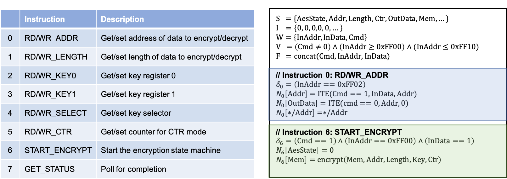
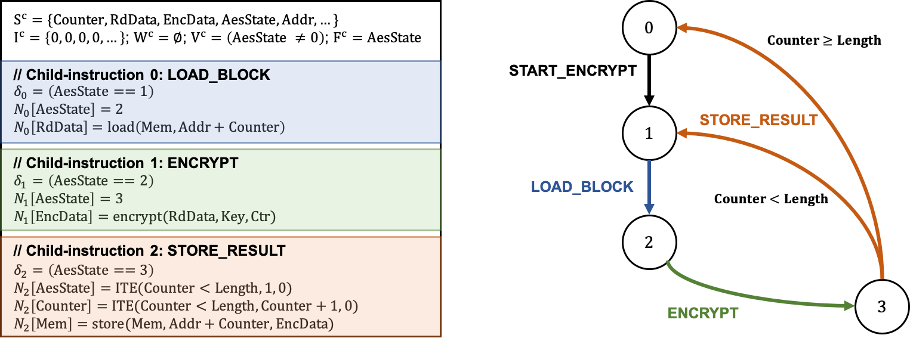

# Modeling

This section covers how to construct the ILA formal model through ILAng's programming interface. You will learn how to define each component of the ILA model. 


This guide only shows a selected list of features. The complete set of all supported API with detailed description can be found [here](https://bo-yuan-huang.github.io/ILAng-Doc/doxygen-output-html/index.html). 


## ILA formal model

As described in [TODAES18](https://bo-yuan-huang.github.io/ILAng-Doc/todaes18.pdf), the ILA formal model has several valuable attributes for modeling and verification. It is modular, with functionality expressed as **a set of instructions**. It enables meaningful abstraction through **architectural state** that is persistent across instructions. It provides for portability through a more durable interface with the interacting processors. It is **hierarchical**, providing for multiple levels of abstraction for modeling complex instructions as a software program through sub- and micro-instructions. 

### AES example

The below image shows the instruction set for the AES cryptographic accelerator from OpenCores.org. The design behavior can be represented using these 8 instructions, e.g., `RD/WR_ADDR`, `START_ENCRYPT`, `GET_STATUS`, etc. Instead of all micro-architectural states/registers, only the architectural states are included in the ILA model. 

The ILA model can be hierarchical, in that it can contains child-ILAs to represent complex operations. It is often easier to describe the architectural state update function as a sequence of steps, i.e., an algorithm. The below image shows the child-ILA of the AES design and also the child-program for the `START_ENCRYPT` instruction.

