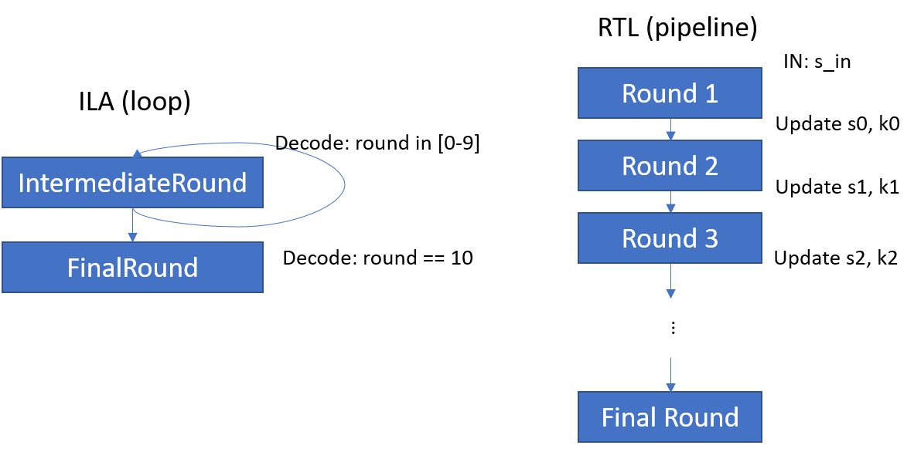
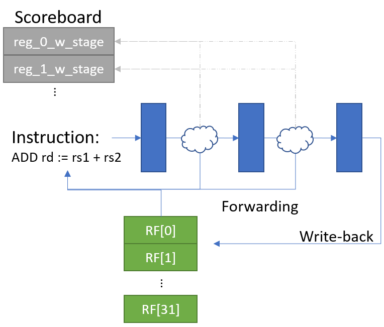
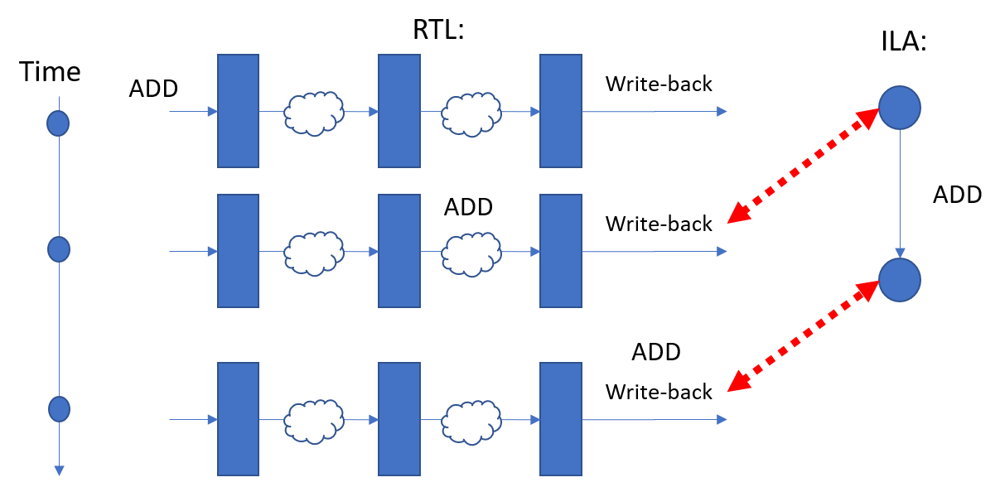

# Examples

Here we'd like to give some examples of the refinement relations. The features described may include some of the syntactic sugar we are currently working on, which will be marked in the text.

## Conditional Mapping

In variable mapping section, the conditional mapping is helpful in many cases. Below we give some examples using conditional mapping.

### Mapping Loop Body with Unrolled Pipelines

Suppose we have a specification for AES-128 function, which consist of 10 rounds of cryptographic operations, each round takes results from previous round and generate new ciphertext and new round key which will be used in the next round. In the ILA model, this is described with the help of child-instructions that form a loop. Whereas, the implementation is a pipeline which corresponds to an unrolling of the loop in the specification. This is illustrated in the figure below.



When verifying the child-instructions, we need to map the state variables holding intermediate results \(suppose it is named as `ciphertext` in ILA\) with signals in Verilog. However, because the loop is unrolled into a 10-stage pipeline, the corresponding Verilog signal for `ciphertext` is dependent on the round. Therefore, we need conditional mapping here, which can be specified as follows.

```javascript
  "state mapping": {
    "ciphertext" : [["ILA.round == 0", "s_in" ],
                    ["ILA.round == 1", "s0"   ],
                    ["ILA.round == 2", "s1"   ],
                    ...
                   ]
  }
```

Or, alternatively, you can use:

```javascript
  "state mapping": {
    "ciphertext" : [{"cond":"ILA.round == 0", "map":"s_in" },
                    {"cond":"ILA.round == 1", "map":"s0"   },
                    {"cond":"ILA.round == 2", "map":"s1"   },
                    ...
                   ]
  }
```

Regarding the `round` variable in ILA, because the loop in Verilog is fully unrolled and the effects of `round` are already reflected in the mapping of `ciphertext`, we don't need a mapping for `round`. We can simply write:

```javascript
  "state mapping": {
    "round" : null,
    ...
  }
```


The condition are treated as a ordered list, namely, only when the first condition does not hold, will the rest of the mapping be considered. You can have a default case with condition `1'b1` or `null`.


### Mapping State Variables with On-the-Fly Values

When tackling pipelined designs, for a software-visible state variable \(e.g., an architectural register\) it is also common that there might be multiple places to look for, especially the value on-the-fly inside the pipeline. Because of forwarding logic, a newly computed value, though not yet written back to the register file, can still be observable for an instruction following it. In the refinement relation, we provide two possible ways to handle the case: conditional mapping and light-weight flushing.



**Conditional mapping.** Usually, inside the pipeline, there are book-keeping logic to track the location of the latest update to an architectural register \(e.g., the scoreboard\). Therefore, one can use this logic to map an architectural register to the corresponding microarchitectural register in the pipeline. Above shows an examples of such a pipeline, it has three stages \(not counting the stages before instruction dispatch\) and a per-register record `reg_X_w_stage`. The left-most bit indicates if the EX \(execute\) stage has a valid write to register X. The right-most bit indicates if the second stage has a write. Based on status indicated by this scoreboard, one can write the refinement for the register as below. It first checks the left-most bit of the scoreboard entry and then the right-most bit and finally the default case. Note how the priority list is used for condition.

```javascript
  "state mapping": {
      ...,
    "r1" : [ {"cond":"m1.reg_1_w_stage[1]", "map":"ex_alu_result"},
             {"cond":"m1.reg_1_w_stage[0]", "map":"ex_wb_val"},
             {"cond":null, "map":"register[1]"}  ],
    "r2" : [...],
    ...
  }
```

**Light-weight flushing.** This is a setting similar to what has been used in ARM's ISA-Formal work. One can use prophecy variables \(variables holding values available in the future\) to help construct the mapping. The value-on-the-fly will be written back to the architectural register file in the future and we can map a register with that future value. Our variable mapping allows this mapping using what we call "value holder" \(it is essentially an auxiliary variable and note that it can also hold history values\). The light-weight flushing setting is illustrated in the figure below:



Again for the previous pipeline example, we can have the variable mapping as follows:

```javascript
  "state mapping": {
      ...,
    "r1" : [ {"cond":"__START__", "map":"#valueholder_r1#"},
             {"cond":"__IEND__", "map":"register[1]"}],
    "r2" : [...],
    ...
  }
```

Here `#` quoted names are the names to value holders. The condition `__START__` indicates, at the beginning of the instruction under verification, `r1` is mapped to the value holder \(a future value in our case\) and at the end of the instruction execution \(indicated by `__IEND__`\), it is mapped to the write-back value in the register file.

Value holders are defined in the `value-holder` section in the variable mapping file. Below is an example. The condition here indicates when to take the value of `m1.register[1]` and hold it for use universally. `stage_tracker` is an example of the monitor that one may add to track the stage of an instrcution in the pipeline \(if the original design already has some tracking mechanism, it can be used instead\).

```javascript
"value-holder": {
  "valueholder_r1":{
     "cond" : "stage_tracker == 1", // Commit point of the previous instruction
     "val"  : "m1.register[1]",
     "width": 8
  }
}
```


`width` in the above example can be set to `"auto"` which will allow the tool to automatically determine the width of the value holder.



We are working on a syntactic sugar in the form of `val@cond` in the `state-mapping` part which can automatically generate a value holder. In the future we shall allow the following shortcut:

```javascript
  "state mapping": {
      ...,
    "r1" : [ {"cond":"__START__", "map":"register[1] @ (stage_tracker == 1)"},
             {"cond":"__IEND__", "map":"register[1]"}],
    "r2" : [...],
    ...
  }
```


## Stage Tracker

As shown by the previous example, it is very often that one would like to track the stage of an instruction. Currently this is done via inline Verilog monitors. For the previous example, we have a monitor like the following.

```javascript
  "verilog-inline-monitors" : {
    "stage_tracker" : {
      "verilog": 
        ["always @(posedge clk) begin",
         "  if (__START__) stage_tracker <= 0;",
         "  else if (__STARTED__ && !__ENDED__) stage_tracker <= stage_tracker + 1;",
         "end"],
      "defs" :[ ["stage_tracker", 2, "reg"] ],
      "refs" :[]
    }
```

This monitor starts the tracking when the instruction under verification starts to execute and counts up till the instruction finishes. This works for the simple case as the pipeline will not stall and the tracker does not need to stall either. However, in general this is not true and below we provide an example to handle a more general case.

In the example below, there are 3 intermediate stages and a final write-back \(s4\) stage. The monitor here uses the signals inside the pipeline like `m1.s1_to_s2$D_IN` and `m1.s1_to_s2$EN` to tell if the current instruction moves to the next stage. These are indicated by the signals like `s1_to_s2`.

```javascript
 "verilog-inline-monitors" : {
    "stage_tracker" : {
      "verilog": 
        [
          "wire s1_begin =  m1.stage1_rg_full;",
          "wire s1_to_s2 =  m1.s1_to_s2$D_IN & m1.s1_to_s2$EN;",
          "wire s2_to_s3 =  m1.s2_to_s3$D_IN & m1.s2_to_s3$EN;",
          "wire s3_to_s4 =  m1.s3_deq$EN & m1.s3_deq$D_IN;",
          "always @(*) begin monitor_s1 = s1_begin & ~monitor_s1_already & __START__; end",
          "always @(posedge clk) begin",
          "    if(rst)",
          "        monitor_s1_already <= 0;",
          "    else if (monitor_s1 && monitor_s2_nxt)",
          "        monitor_s1_already <= 1;",
          "end",
          "always @(*) begin monitor_s2_nxt = (monitor_s2 == 0) ? ( s1_to_s2 & monitor_s1 ?  1'b1 : 1'b0) : ",
          "  ( s2_to_s3  ?  1'b0 : 1'b1); end",
          "always @(posedge clk) begin",
          "    if(rst) begin",
          "        monitor_s2 <= 0;",
          "        monitor_s2_already <= 0;",
          "    end",
          "    else begin",
          "        monitor_s2 <= monitor_s2_nxt;",
          "        if (monitor_s2 & monitor_s3_nxt)",
          "            monitor_s2_already <= 1;",
          "    end",
          "end",
          "always @(*) begin monitor_s3_nxt = (monitor_s3 == 0) ? ( s2_to_s3 & monitor_s2 ?  1'b1 : 1'b0) : ",
          "  (s3_to_s4 ? 1'b0 : 1'b1) ; end ",
          "always @(posedge clk) begin",
          "    if(rst) begin",
          "        monitor_s3 <= 0;",
          "        monitor_s3_delay <= 0;",
          "    end",
          "    else begin",
          "        monitor_s3 <= monitor_s3_nxt;",
          "        if (monitor_s3)",
          "            monitor_s3_delay <= 1'b1; // enough",
          "    end",
          "end",
          "always @(*) begin monitor_s4_nxt = ",
          "  monitor_s3 && s3_to_s4 ? 1'b1 : monitor_s4; end",
          "always @(posedge clk) begin",
          "    if(rst) begin",
          "        monitor_s4 <= 0;",
          "        monitor_s4_delay <= 0;",
          "    end",
          "    else begin",
          "        monitor_s4 <= monitor_s4_nxt;",
          "        if (monitor_s4)",
          "            monitor_s4_delay <= 1'b1;",
          "    end",
          "end",
          "always @(*) begin end_of_pipeline = monitor_s4 && ~monitor_s4_delay ; end // just check one cycle"
        ],
      "defs" :
          [
          ["end_of_pipeline"     , 1 , "reg"]  ,
          ["monitor_s1_already"  , 1 , "reg"]  ,
          ["monitor_s1"          , 1 , "reg"]  ,
          ["monitor_s1_delay"    , 1 , "reg"]  ,
          ["monitor_s2"          , 1 , "reg"]  ,
          ["monitor_s2_nxt"      , 1 , "reg"]  ,
          ["monitor_s2_already"  , 1 , "reg"]  ,
          ["monitor_s3"          , 1 , "reg"]  ,
          ["monitor_s3_nxt"      , 1 , "reg"]  ,
          ["monitor_s3_delay"    , 1 , "reg"]  ,
          ["monitor_s4_nxt"      , 1 , "reg"]  ,
          ["monitor_s4"          , 1 , "reg"]  ,
          ["monitor_s4_delay"    , 1 , "reg"]
      ] ,

      "refs" :[
        "m1.stage1_rg_full", 
        "m1.s1_to_s2$D_IN",
        "m1.s1_to_s2$EN",
        "m1.s2_to_s3$D_IN",
        "m1.s2_to_s3$EN",
        "m1.s3_deq$D_IN",
        "m1.s3_deq$EN",
        "m1.rg_retiring$EN" ]
    }// stage tracker
  }
```


As the tracking of pipeline stages is a very common scenario, we are also working on a template to automatically generate a pipeline stage tracker. We expect this to handle the case of branching pipelines \(where there are fan-out points to dispatch instructions through any of the downstream pipelines, and merge point that coalesce the end of multiple pipelines\). Events are specified based on their effects on the stages as `exit` event and `enter` event. We shall also allow caching temporary values in auxiliary variables at the time of the events.


## Simple Delays

Another common scenario is that we'd like to delay a signal for a few cycles. The general way for this is an inline-monitor. For example, we'd like to delay `xram_ack` for one cycle and use it as the finish condition for an instruction. First, we can have a few lines in `verilog-inline-monitors` section as follows:

```javascript
"verilog-inline-monitors" : {
  "xram_ack_delay_1" :  {
      "verilog": [
        "always @(posedge clk) begin xram_ack_delay_1 <= xram_ack; end"
      ],
      "defs" : [["xram_ack_delay_1"     , 1 , "reg"]],
      "refs" : ["xram_ack"]
  }
}
```

Recall that `defs` contains the auxiliary variables that we'd like to create and `refs` are the signals in the original design that we use in the monitor.


We are working on a syntactic sugar in the form of `signal ## cycle` and `(expression) ## cycle` that will create verilog-inline-monitor automatically to delay a signal for the given number of cycles.


